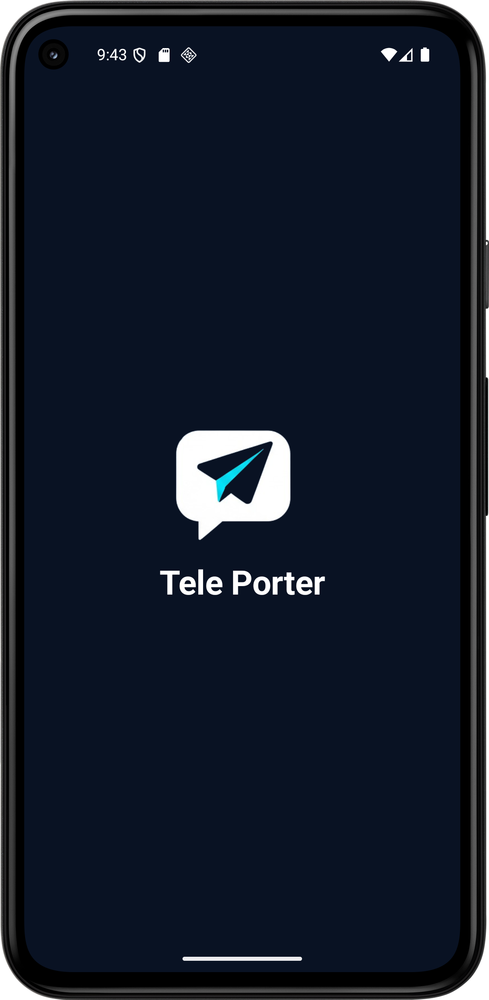
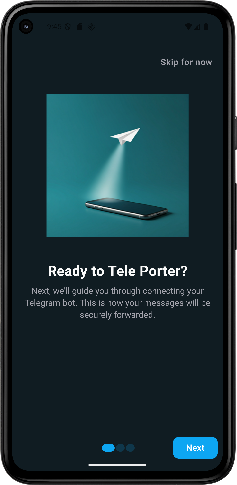
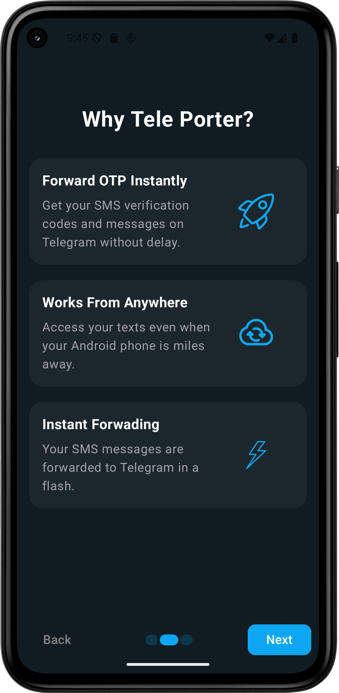
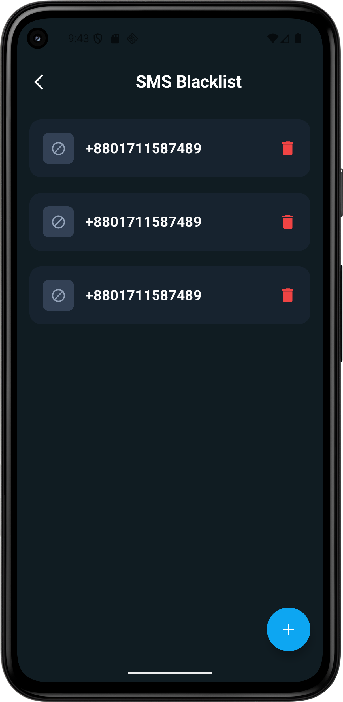
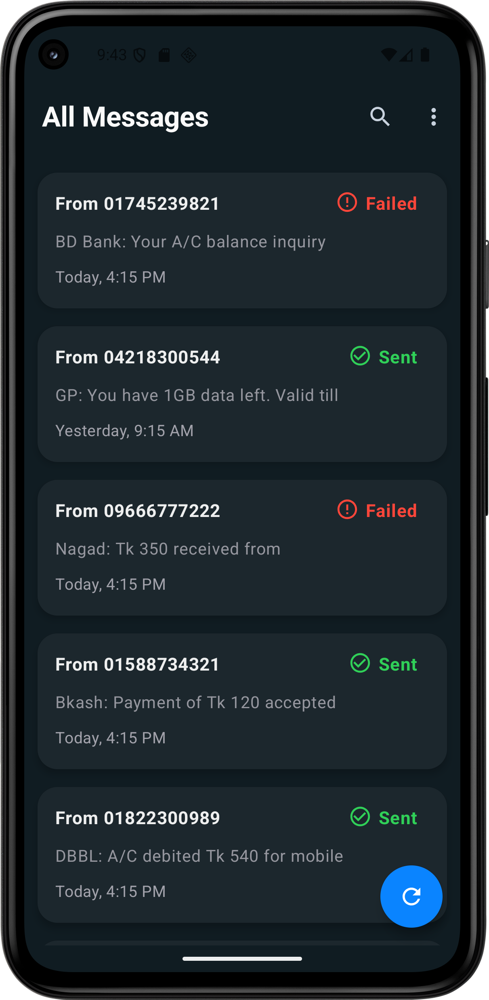
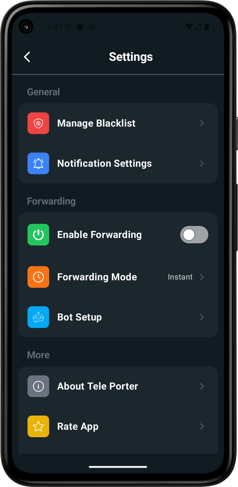
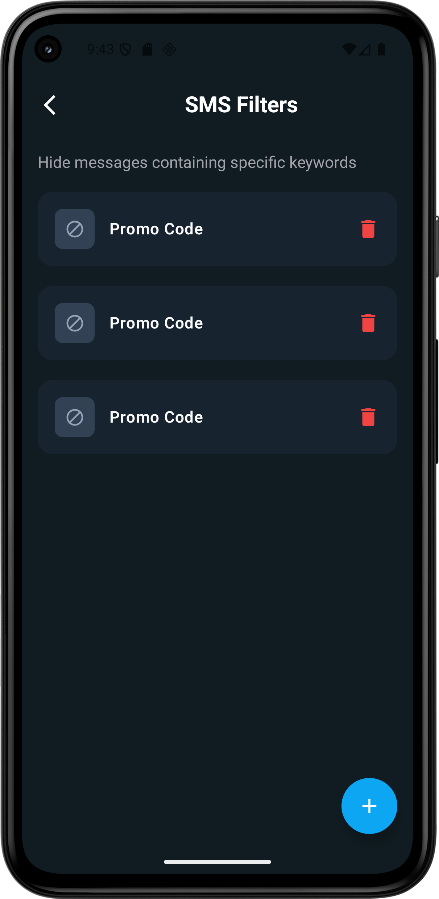
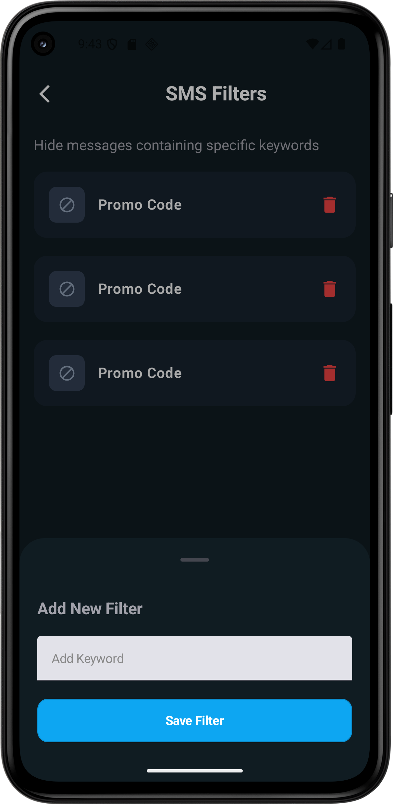

<!-- Paste this into README.md — GitHub renders HTML inside markdown -->
<h1 align="center">TelePorter — Screens</h1>

  

  <figure style="width:200px;text-align:center;margin:0;">
    
    <figcaption>onb_1</figcaption>
  </figure>

  <figure style="width:200px;text-align:center;margin:0;">
    
    <figcaption>onb_2</figcaption>
  </figure>

  <figure style="width:200px;text-align:center;margin:0;">
    
    <figcaption>botsetup</figcaption>
  </figure>

  <figure style="width:200px;text-align:center;margin:0;">
    
    <figcaption>blacklist</figcaption>
  </figure>

  <figure style="width:200px;text-align:center;margin:0;">
    
    <figcaption>home</figcaption>
  </figure>

  <figure style="width:200px;text-align:center;margin:0;">
    
    <figcaption>settings</figcaption>
  </figure>

  <figure style="width:200px;text-align:center;margin:0;">
    
    <figcaption>smsfilter</figcaption>
  </figure>

  <figure style="width:200px;text-align:center;margin:0;">
    
    <figcaption>smsfilter2</figcaption>
  </figure>

